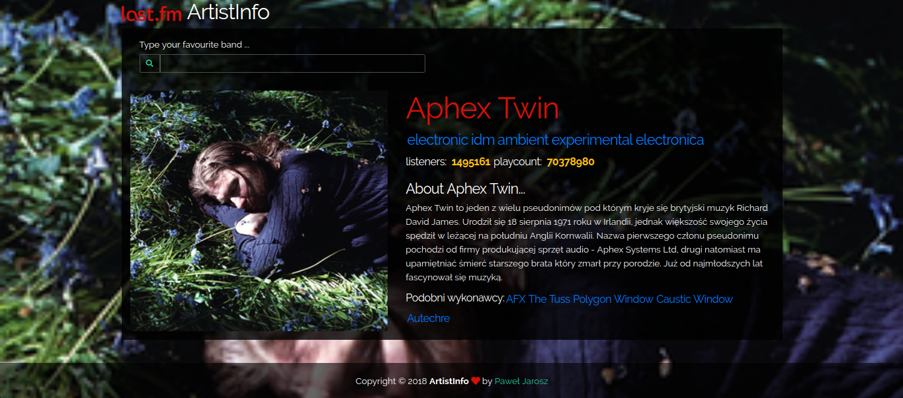

# ArtistInfo

> a simple ReactJS application that presents information about the music artist using the LastFM API.



- you can easly try <b>demo</b> on [github pages](https://burziszcze.github.io/Artistinfo/)
  or on [Heroku](https://artists-info.herokuapp.com/)

## Quick Start

```bash
# Clone repository
git clone https://github.com/Burziszcze/Artistinfo.git

# Install dependencies for server
npm install

# Run the client
npm run dev

# Client runs on http://localhost:3000
```

### Add your Last.fm API key

> Get your own API key by [Apply here](https://www.last.fm/api/account/create)

```bash
# create .env file inside your root folder
REACT_APP_API_KEY=<Your_LastFm_API_Key>
```

## App Info

### Author

Paul Vegan

### Version

1.0.0

### License

This project is licensed under the MIT License
